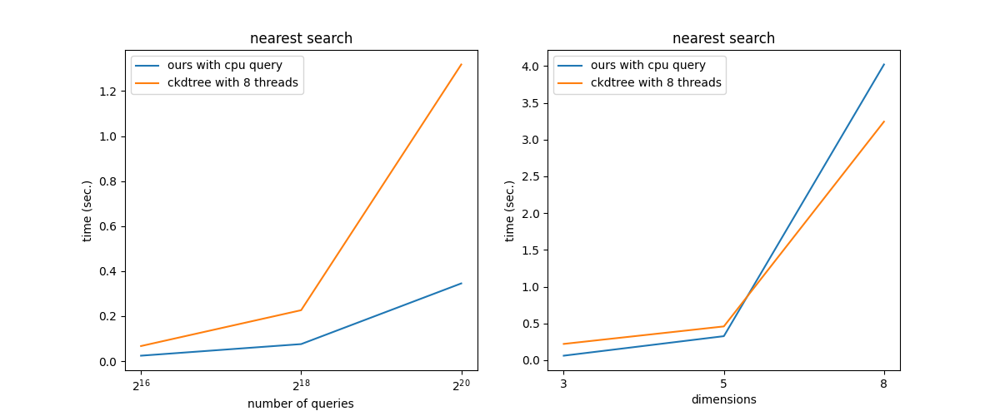

# A CUDA implementation of KDTree in PyTorch

This is specially useful if the point cloud is very large (>100,000 points).

Currently KD-Tree is built on CUDA, and the query is done on CPU.
We are now working on making a new function of querying point on CUDA device, which should be faster. 

Query functions currently implemented:
- nearest search (CPU; CUDA for experimental testing)
- knn search (CPU)
- radius search (CPU)


**NOTE: this repo is still under heavy development**


# build

my build environment: (other environment should be okey)
- torch == 1.8.0
- nvcc == 10.2

there are generally two ways to build the library.
1. build with cmake:
```
mkdir build && cd build

cmake .. \
-DCMAKE_PREFIX_PATH=`python -c 'import torch;print(torch.utils.cmake_prefix_path)'` \
-DCMAKE_CUDA_ARCHITECTURES=60 \
-DCUDA_TOOLKIT_ROOT_DIR=$CU102_CUDA_TOOLKIT_DIR

make -j8
```

2. build with setuptools:
```
TORCH_CUDA_ARCH_LIST="6.0+PTX" python setup.py develop
```


# usage

please check the testing script in `test/perf/` folder.


# benchmarking

**nearest search**



# TODO

- [x] multiple trees memory conflict
- [x] remove all global variables such as `d_verifyKdTreeError`
- [ ] do not use queue; search down and update dist
- [ ] template for other cases N > 32
- [ ] CUDA query
- [ ] cuda-tree do not own host memory; cpu-tree do not own cuda memory
- [ ] host memory leak testing
- [ ] support any num of points

# About

This work is largely based on an existing repo: [KdTreeGPU](https://github.com/johnarobinson77/KdTreeGPU).
All I did was improve it a bit, write codes for tree traversal, and expose pytorch interfaces to make it easier to use.

Developer: Jiabao Lei

Email: eejblei@mail.scut.edu.cn
